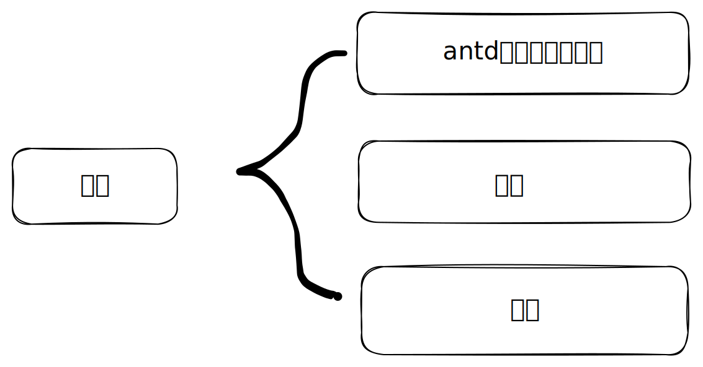

## 为什么要做？

随着B端面向客户的需求、业务拓展越来越多，对于B端UI的要求也越来越高。

现在面临一个问题，就是如何高效的完成业务开发，使开发尽可能减少对UI的关注，并且能够方便开发维护系统，而不是对UI组件无限的“复制、粘贴”。甚至如何提升UI同学的验收效率，减少前端开发的UI问题。

现在开始建立一套公共的定制化的，符合UI规范的一套组件库。为了减少成本，并且快速的响应业务，前端基于 antd v5 版 这套组件库进行两个方面的拓展：
1. 功能上：对 antd 基础组件进行包裹，使用一些默认的属性或者允许传入一些其他属性，来达到快速开发的目的。
2. 样式上：对 antd 基础组件进行 token 的重写，以及基于 emotion 的 css-in-js 方案，对样式进行覆盖。

这样，一方面组件更贴合公司业务和操作习惯，另一方面开发也能够从繁琐的UI样式上脱离出来，更专心于如何把业务逻辑完成好。

## 如何设计？

整体的设计思路如下：



总体来说会把一个组件设计成为两个模块
1. 对 antd 基础组件的功能逻辑拓展，比如做一些默认属性，而不是在每个组件中都去设置一遍。再比如对 Button 组件添加默认的 loading 行为，而不需要在业务逻辑中控制 loading 属性。
2. 对 antd 主题的定制，当然可以在组件库定义多套主题，快速切换。对于 antd v5 提供的主题定制，设计上会下沉到组件层级，方便复用。并且，antd v5 的 token 定义的比较模糊，能够定义的内容也比较少。

然后再通过 Mix 把两者混合。形成一个既有业务逻辑又有样式的组件。开发开箱即用。

## 如何使用

### 安装

```bash
$ npm i @m-tools/antd-ext --save
```

安装后的组件主要包含两个部分：
1. 拓展的组件，以“Ext”结尾；
2. antd 的基础组件；

### 如何在 antd v4 的版本上做升级
引用 ConfigProviderExt 组件，对全局App做配置，目的是为了两点：
* 配置 themeExt 主题
* 配置 prefixCls 更改样式前缀

```typescript
import React from 'react';
import { ConfigProvider } from 'antd';
import zhCN from 'antd/lib/locale-provider/zh_CN';
import { ConfigProviderExt, ButtonExt } from '@m-tools/antd-ext';

function SomeComponent() {
  return <ButtonExt type="primary">Test</ButtonExt>
}

export default function App() {
  return (
    <ConfigProvider
      locale={zhCN}
    >
      <ConfigProviderExt themeExt="hermes" prefixCls="antdext">
        {/* 子组件 */}
        <SomeComponent />
      </ConfigProviderExt>
    </ConfigProvider>
  );
}
```

这样拓展的组件可以使用 “antdext” 的前缀而不会和 antd v4 的版本样式冲突，以达到渐进式的替换组件的目的。
